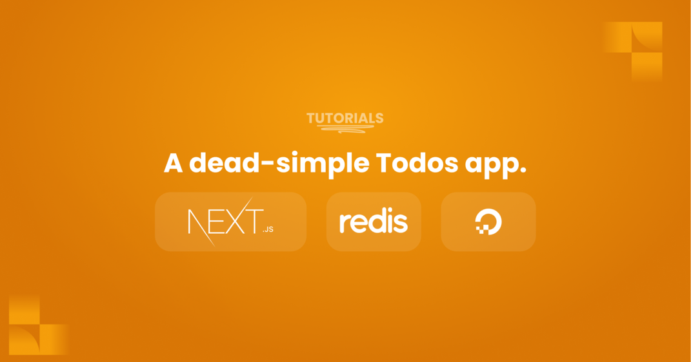

<p align="center"></p>
<h1 align="center">A dead-simple Todos app, powered by Redis.</h1>



<br />

## How to run it locally?

### Prerequisites

- Node - v14+
- NPM - v6+

### Local installation

Get started by [installing Redis](https://redis.io/docs/getting-started/installation/) on your machine.

Once that's done, clone this project into your local computer:

```bash
git clone https://github.com/eludadev/redis-todos.git
```

After that, rename the `.env.sample` file to `.env`, and type-in your Redis credentials:

```bash
mv .env.sample .env
```

Next, go to the project's root directory and run the following commands:

```bash
npm install
npm run dev
```

If all goes well, navigate your preferred browser to the `http://localhost:3000` URL. Test the app out:
- Create new todos using the input bar on top.
- Complete todos by tapping anywhere on their area.
- Update and delete todos using their respective buttons.

Furthermore, this app handles loading and error states for each action.